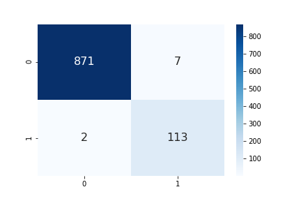
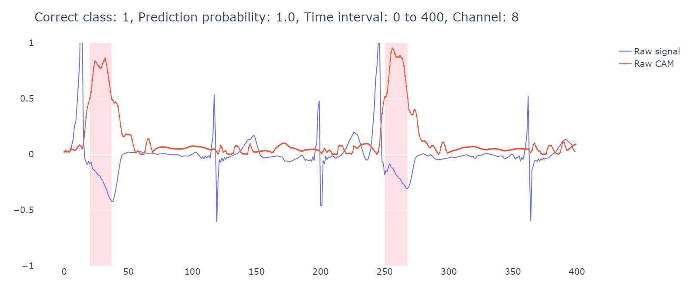

# Application of score-weighted class activation mapping (Score-CAM) on one dimensional convolutional neural networks (1D-CNN).
Application of Score-CAM on 1D-CNN classifying the electrocardiogram (ECG). For the intepretability, the model was trained for classifying normal ECG and ECG with Premature Ventricular Complex (PVC).

## Dataset
- The publicly available dataset, PTB-XL; Wagner, P., Strodthoff, N., Bousseljot, RD. et al. [PTB-XL](https://doi.org/10.1038/s41597-020-0495-6), a large publicly available electrocardiography dataset. Sci Data 7, 154 (2020).
- One must apply for the credential access to obtain and use the data on [PhysioNet](https://physionet.org/).

## Results
### Accuracy
```
loss: 0.029, Acc: 0.99
```


### Example visualization
The highlighted background indicates CAM values above 90th percentile of all the CAM value. The algorithm seems to capture where the PVC occurs.
